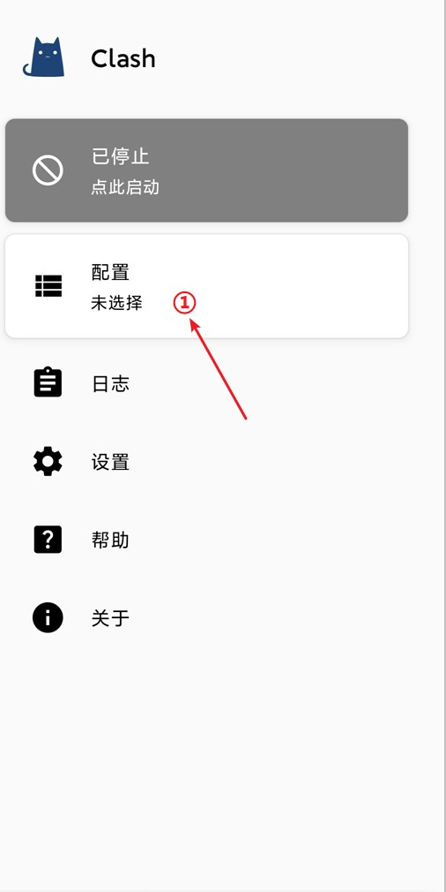
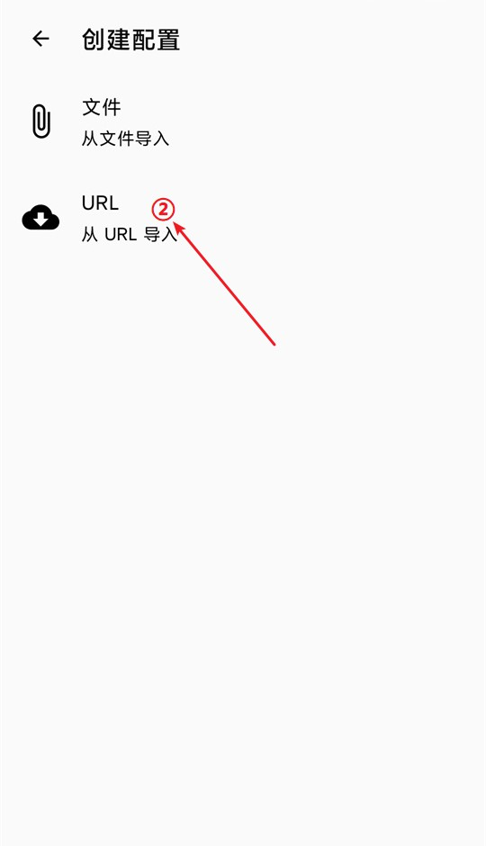
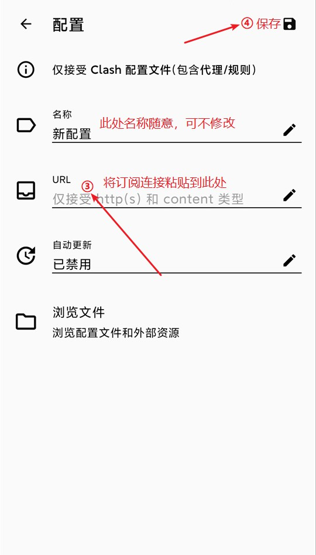
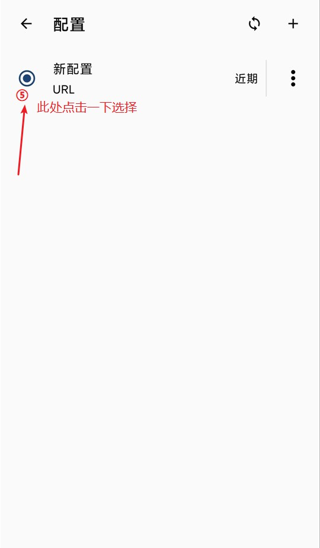
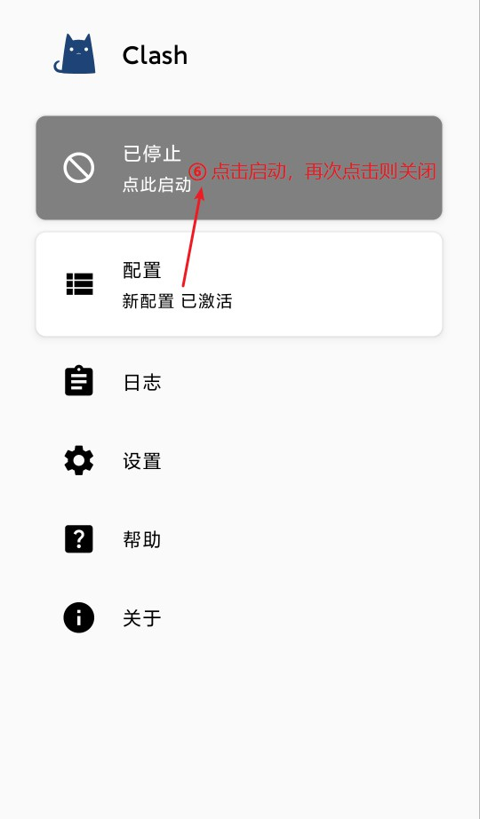
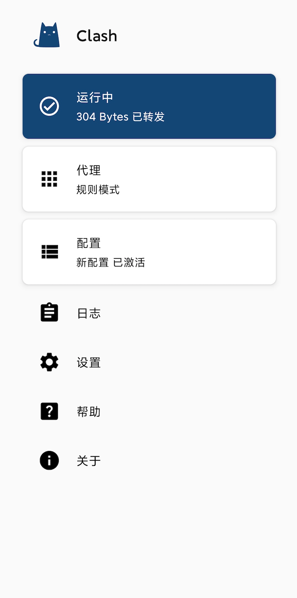

# Android-Clash

## 1、下载地址

点击下载:point\_right:[Android-clash-2.4.9.apk](https://wwa.lanzoui.com/iRwkBwfsghi)


:woman\_mage:**Tips:** 推荐使用手机自带浏览器下载安装


## 2、配置订阅


:woman\_mage: **Tips:** 初次使用会弹出“网络连接请求”提示框，点击确定即可。



正常启动后浏览器访问[www.google.com](https://www.google.com)测试是否正常连接。

