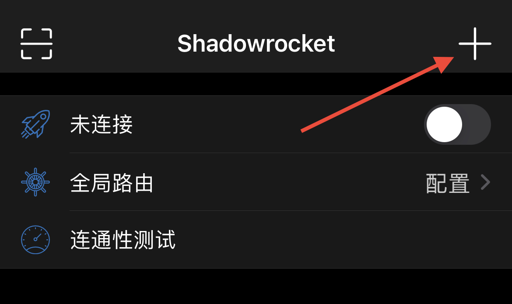
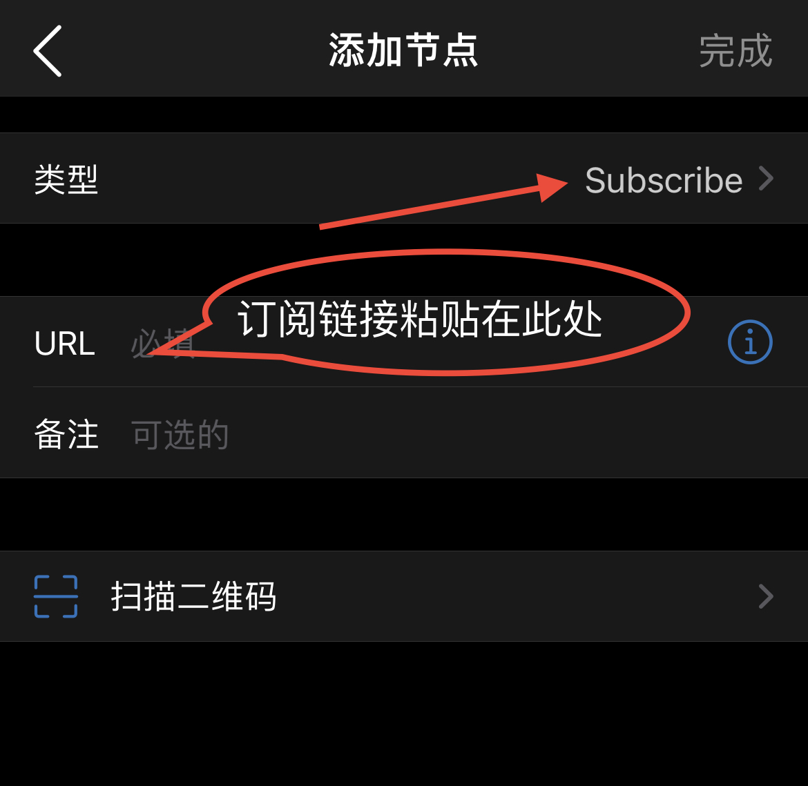
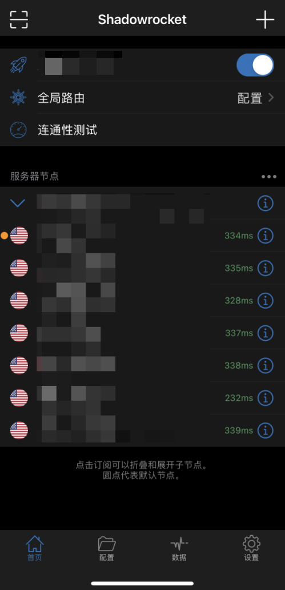

# Shadowrocket（小火箭）

## 1、下载小火箭

小火箭Shadowrocket需要切换App Store账号到美区下载，使用美区id下载。

## 2、配置订阅

点开首页右上角的 “+” 即可添加订阅地址

类型选择Subscribe，然后将订阅连接粘贴在URL处，点击完成保存

回到首页，点击任一节点，全局路由那里，选择“配置”，点击最上面的连接按钮，变绿即可。首次连接时弹框提醒选择“ Allow (允许) ”。

